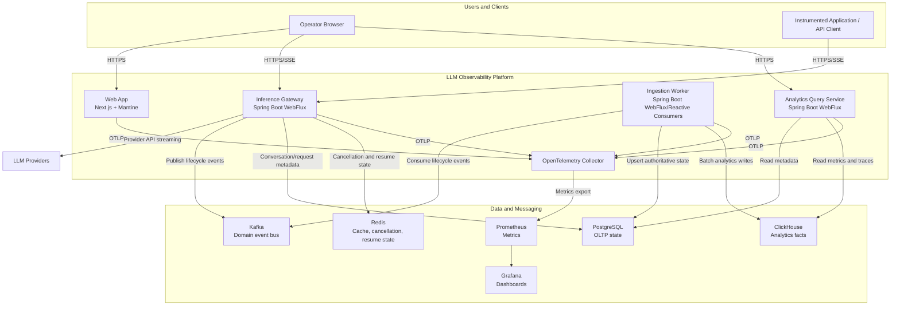

# Container Diagram

## Purpose

This diagram shows the planned internal containers and data stores. It is intentionally service-level; implementation package details are documented in [Repository Structure](../repository-structure.md).

## Container Responsibilities

| Container | Responsibility |
| --- | --- |
| Web App | Operator workflows, dashboards, trace exploration, project/provider settings |
| Inference Gateway | API validation, streaming, provider selection, cancellation, lifecycle event publishing |
| Ingestion Worker | Kafka consumption, idempotent persistence, ClickHouse ingestion, retry/dead-letter handling |
| Analytics Query Service | Dashboard and trace query APIs with authorization and query controls |
| Kafka | Durable event bus for inference and observability lifecycle events |
| PostgreSQL | Authoritative tenant, project, conversation, request, and provider configuration data |
| ClickHouse | High-volume inference analytics, token facts, latency, cost, errors |
| Redis | Stream cursors, cancellation flags, short-lived cache, rate-limit counters if needed |
| OTel Collector | Telemetry collection, processing, and export |
| Prometheus/Grafana | Metrics storage, dashboards, and alerting integration |

## Key Tradeoffs

- Keeping analytics query separate from ingestion avoids coupling dashboard latency to consumer throughput.
- Gateway writes minimal authoritative state and publishes events so streaming remains responsive.
- Redis state is short-lived and must not be the only source of truth for completed conversations.

