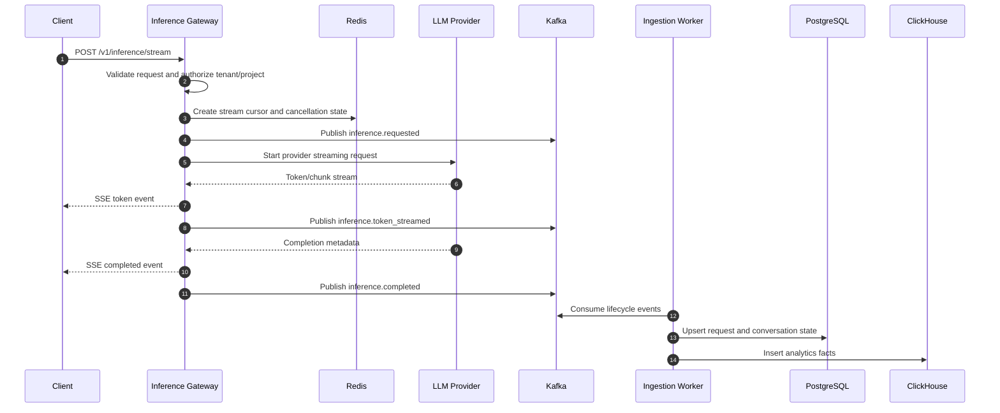
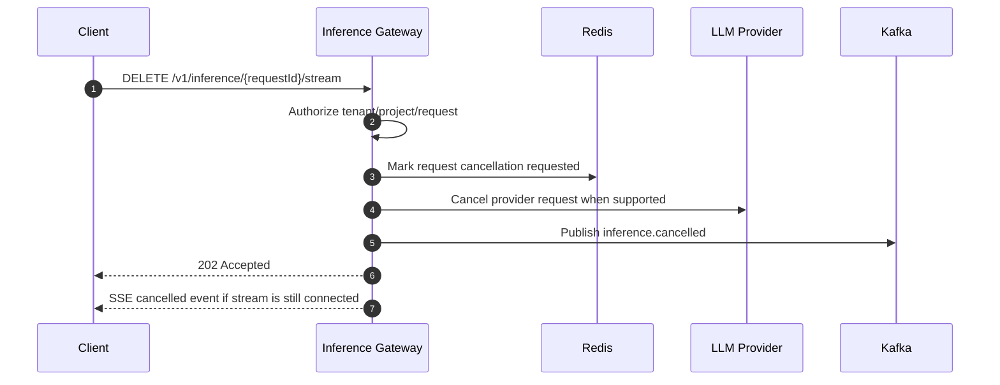
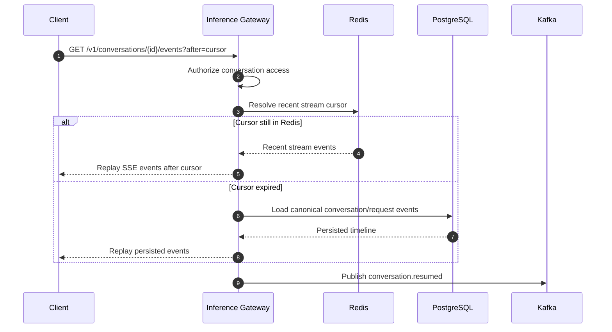
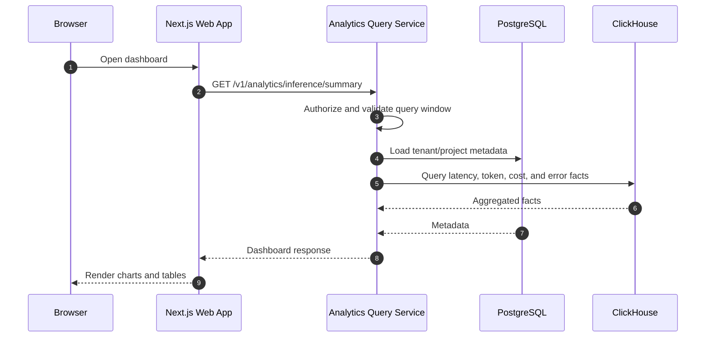
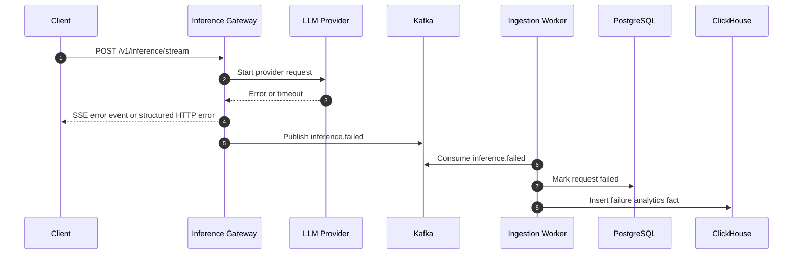

# High-Level Sequence Flows

## Streaming Inference

```mermaid
sequenceDiagram
    autonumber
    participant Client
    participant Gateway as Inference Gateway
    participant Redis
    participant Provider as LLM Provider
    participant Kafka
    participant Worker as Ingestion Worker
    participant PG as PostgreSQL
    participant CH as ClickHouse

    Client->>Gateway: POST /v1/inference/stream
    Gateway->>Gateway: Validate request and authorize tenant/project
    Gateway->>Redis: Create stream cursor and cancellation state
    Gateway->>Kafka: Publish inference.requested
    Gateway->>Provider: Start provider streaming request
    Provider-->>Gateway: Token/chunk stream
    Gateway-->>Client: SSE token event
    Gateway->>Kafka: Publish inference.token_streamed
    Provider-->>Gateway: Completion metadata
    Gateway-->>Client: SSE completed event
    Gateway->>Kafka: Publish inference.completed
    Worker->>Kafka: Consume lifecycle events
    Worker->>PG: Upsert request and conversation state
    Worker->>CH: Insert analytics facts
```

## Cancellation

```mermaid
sequenceDiagram
    autonumber
    participant Client
    participant Gateway as Inference Gateway
    participant Redis
    participant Provider as LLM Provider
    participant Kafka

    Client->>Gateway: DELETE /v1/inference/{requestId}/stream
    Gateway->>Gateway: Authorize tenant/project/request
    Gateway->>Redis: Mark request cancellation requested
    Gateway->>Provider: Cancel provider request when supported
    Gateway->>Kafka: Publish inference.cancelled
    Gateway-->>Client: 202 Accepted
    Gateway-->>Client: SSE cancelled event if stream is still connected
```

## Resumable Conversation Stream

```mermaid
sequenceDiagram
    autonumber
    participant Client
    participant Gateway as Inference Gateway
    participant Redis
    participant PG as PostgreSQL
    participant Kafka

    Client->>Gateway: GET /v1/conversations/{id}/events?after=cursor
    Gateway->>Gateway: Authorize conversation access
    Gateway->>Redis: Resolve recent stream cursor
    alt Cursor still in Redis
        Redis-->>Gateway: Recent stream events
        Gateway-->>Client: Replay SSE events after cursor
    else Cursor expired
        Gateway->>PG: Load canonical conversation/request events
        PG-->>Gateway: Persisted timeline
        Gateway-->>Client: Replay persisted events
    end
    Gateway->>Kafka: Publish conversation.resumed
```

## Analytics Query

```mermaid
sequenceDiagram
    autonumber
    participant Browser
    participant Web as Next.js Web App
    participant Analytics as Analytics Query Service
    participant PG as PostgreSQL
    participant CH as ClickHouse

    Browser->>Web: Open dashboard
    Web->>Analytics: GET /v1/analytics/inference/summary
    Analytics->>Analytics: Authorize and validate query window
    Analytics->>PG: Load tenant/project metadata
    Analytics->>CH: Query latency, token, cost, and error facts
    CH-->>Analytics: Aggregated facts
    PG-->>Analytics: Metadata
    Analytics-->>Web: Dashboard response
    Web-->>Browser: Render charts and tables
```

## Provider Failure

```mermaid
sequenceDiagram
    autonumber
    participant Client
    participant Gateway as Inference Gateway
    participant Provider as LLM Provider
    participant Kafka
    participant Worker as Ingestion Worker
    participant PG as PostgreSQL
    participant CH as ClickHouse

    Client->>Gateway: POST /v1/inference/stream
    Gateway->>Provider: Start provider request
    Provider-->>Gateway: Error or timeout
    Gateway-->>Client: SSE error event or structured HTTP error
    Gateway->>Kafka: Publish inference.failed
    Worker->>Kafka: Consume inference.failed
    Worker->>PG: Mark request failed
    Worker->>CH: Insert failure analytics fact
```

