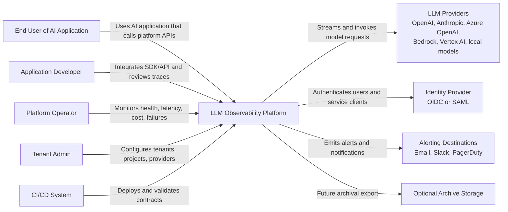

# System Context Diagram

## Purpose

This diagram shows the platform boundary and its primary external actors and systems.

## Context Notes

- The platform can proxy inference requests directly or receive inference logs from instrumented applications in a later phase.
- LLM providers are external systems with different streaming, cancellation, retry, rate limit, and token accounting semantics.
- Identity integration is assumed but not specified. A later security spec must decide the exact provider, claims, roles, and service account model.
- Alerting destinations are downstream consumers of SLO and anomaly signals, not the source of truth for inference telemetry.

## Production Concerns

- Provider credentials must be isolated by tenant/project and never exposed to the frontend.
- All external calls need timeouts, retry policies, circuit breakers, and trace propagation where supported.
- Identity, provider, and alerting integrations must be tested with failure-mode scenarios.

