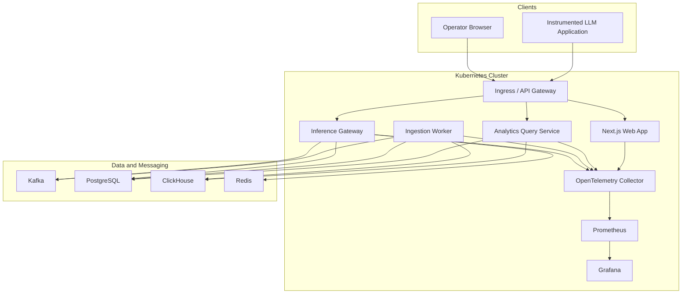

# Deployment Strategy

## Goals

- Support local, staging, and production deployments with consistent service boundaries.
- Package each service independently while preserving shared contract governance.
- Use Kubernetes and Helm for production deployment.
- Keep Docker Compose as a local development topology, not the production deployment mechanism.

## Scope

- Service Dockerfiles.
- Docker Compose for local development.
- Helm charts for Kubernetes.
- Environment-specific configuration.
- Health, readiness, startup probes, metrics, tracing, and logs.
- Rollout and rollback practices.

## Non-Goals

- Cloud provider provisioning is not defined yet.
- Managed service choices for Kafka, PostgreSQL, ClickHouse, Redis, and Grafana are not finalized.
- Multi-region active-active deployment is not in the initial production scope.

## Deployment Architecture

## Containerization Standards

- Every service has its own Dockerfile.
- Images should run as non-root users.
- Images should be small, reproducible, and pinned to supported base images.
- Runtime configuration comes from environment variables, mounted secrets, or platform config.
- Build metadata should include commit SHA, build time, and version.

## Kubernetes Standards

Every service deployment must define:

- Resource requests and limits.
- Liveness, readiness, and startup probes.
- Pod disruption budgets where availability matters.
- Horizontal pod autoscaling policy where scaling behavior is known.
- ConfigMap and Secret references.
- Network policy once namespaces and ingress model are defined.
- Prometheus scrape configuration.
- OpenTelemetry exporter configuration.

## Rollout Strategy

- Use rolling updates for stateless services.
- Use canary or blue/green rollout for risky API and provider-adapter changes.
- Run schema migrations as controlled jobs, not implicit application startup side effects.
- Backward-compatible database and event schema changes must be deployed before code that depends on them.
- Rollback must preserve compatibility with in-flight events and previous schema versions.

## Environment Strategy

| Environment | Purpose | Characteristics |
| --- | --- | --- |
| Local | Development | Docker Compose, local secrets, seeded data |
| CI | Validation | Contract, unit, integration, and container tests |
| Staging | Production rehearsal | Kubernetes, realistic data shape, non-production credentials |
| Production | Customer workload | Kubernetes, managed or hardened dependencies, SLO monitoring |

## Acceptance Criteria

- Service Dockerfiles exist and pass vulnerability and configuration checks.
- Helm chart deploys all services with health checks and telemetry.
- Staging deployment validates migrations, event consumers, and dashboard queries.
- Rollback procedure is documented and tested.
- README and setup docs reflect actual deployment commands.

## Risks

- Managed service differences can affect Kafka retention, ClickHouse ingestion, Redis persistence, and PostgreSQL failover behavior.
- Schema migration failures can block deploys if rollback design is not explicit.
- Kubernetes resource limits require load-test feedback to tune safely.

