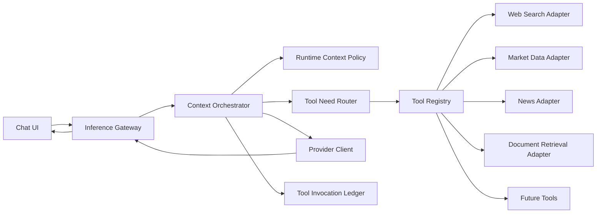

# Phase 08 Specification: Context Orchestrator and Live Data Grounding

## Implementation Status

Status as of 2026-05-24: approved for MVP implementation after review. ADR-0018 records the
approved recommendations for platform-mediated tools, Tavily web search, CoinGecko market data,
metadata-only persistence, Redis cache, and SSE source display.

## Problem Statement

The chatbot can currently answer time-sensitive questions from stale model knowledge because
`services/inference-gateway` forwards user and conversation messages directly to the provider
without a runtime system policy, live data retrieval, tool selection, or source provenance.

Examples of affected queries:

- current crypto, stock, commodity, or exchange-rate prices
- latest news or recent events
- current laws, regulations, public officials, company executives, or product releases
- weather, sports schedules, travel schedules, availability, or version-specific software facts
- any high-stakes financial, legal, medical, or security answer where freshness matters

The fix must be extensible across providers and future tools while preserving the platform's
clean architecture, streaming UX, observability, privacy, and auditability.

## Goals

- Add a provider-agnostic context orchestration layer inside the inference flow.
- Inject runtime context, including current date, current time, and timezone, into every provider request.
- Detect requests that need live or external context before final answer generation.
- Execute backend-owned tools for approved freshness-sensitive categories.
- Ground the final model answer in normalized evidence with source timestamps.
- Stream tool progress and final model output through the existing SSE pipeline.
- Persist tool invocation metadata for observability, audit, debugging, and analytics.
- Keep raw user content, tool credentials, search results, and provider secrets out of logs and Kafka events.
- Preserve domain and application boundaries so provider adapters do not own tool policy.

## Non-Goals

- No arbitrary browser-side tool execution.
- No model access to arbitrary network URLs.
- No autonomous multi-agent workflow or unbounded recursive planning.
- No scraping of paywalled or access-restricted sources.
- No production authentication provider implementation beyond existing Phase 6 assumptions.
- No replacement of the inference gateway as stream lifecycle owner.
- No guarantee that every factual answer is correct; the feature improves grounding and freshness, but source quality still matters.
- No durable token-level replay unless a later phase reintroduces `inference_stream_event`.

## Current-State Constraints

- `apps/web` sends chat turns to `services/inference-gateway` through streaming POST APIs.
- The inference gateway owns conversation creation, continuation, cancellation, provider streaming, PostgreSQL persistence, Redis active-stream state, and Kafka lifecycle events.
- Provider behavior is isolated behind `ProviderClient`.
- Gemini currently supports `systemInstruction` in the adapter only when a `system` message exists in the provider request.
- The platform does not currently inject a system instruction with the current date/time.
- The platform does not currently expose web search, market data, news, weather, or document retrieval tools.

## Proposed Architecture



The Context Orchestrator lives in the `services/inference-gateway` application layer for the
initial implementation. It coordinates runtime context injection, tool routing, tool execution,
evidence normalization, provider prompt construction, SSE progress events, and metadata
persistence. Tool integrations are outbound ports and adapters.

Extraction into a dedicated `context-service` is deferred until multiple services need shared
tool execution or tool workloads require independent scaling.

## Proposed Components

### Runtime Context Policy

Every provider request receives a platform-owned system instruction before user content:

```text
Current date: <ISO_LOCAL_DATE>
Current time: <ISO_OFFSET_DATE_TIME>
Current timezone: <IANA_TIMEZONE>

For current, recent, volatile, or high-stakes facts, use available tools before answering.
If required tools are unavailable or fail, state that the answer may be stale or incomplete.
Do not invent source URLs, prices, dates, regulations, software versions, or news.
```

Runtime context must be generated by the backend at request time, not by the browser.

### Tool Need Router

The router decides whether external context is required.

The first implementation should use deterministic rules plus a small classification model hook
only if needed. Deterministic routing is preferred for auditability and testing.

Tool-required categories:

- market data: crypto, stocks, commodities, rates, ATHs, market cap, volume
- latest or recent news
- laws, regulations, elections, public officials, and company leadership
- weather, travel, sports, events, and schedules
- software versions, product availability, pricing, changelogs, CVEs, and standards
- high-stakes medical, legal, financial, or security guidance

Router output:

```json
{
  "requiresTools": true,
  "reason": "Question asks for current Bitcoin all-time-high timing and market context.",
  "categories": ["market_data", "news"],
  "toolPlan": [
    { "toolName": "marketData.lookup", "purpose": "Fetch current BTC price and recent ATH reference." },
    { "toolName": "webSearch.search", "purpose": "Fetch recent source-backed market commentary." }
  ]
}
```

### Tool Registry

Tools are backend-owned capabilities with explicit metadata:

- tool name
- description
- input schema
- output schema
- timeout
- retry policy
- cache policy
- tenant enablement
- source/citation support
- sensitivity classification
- allowed domains or upstream providers

Initial tool ports:

- `MarketDataPort`
- `WebSearchPort`
- `NewsSearchPort`
- `DocumentRetrievalPort`

Possible future ports:

- `WeatherPort`
- `SportsDataPort`
- `CompanyLookupPort`
- `SoftwareVersionPort`
- `SecurityAdvisoryPort`

### Evidence Model

Tool results must be normalized before being passed to the provider.

Required fields:

- `evidenceId`
- `toolName`
- `sourceName`
- `sourceUrl`
- `title`
- `fetchedAt`
- `publishedAt`
- `content`
- `confidence`
- `freshnessWindow`

Example:

```json
{
  "evidenceId": "01HX...",
  "toolName": "marketData.lookup",
  "sourceName": "CoinGecko",
  "sourceUrl": "https://www.coingecko.com/en/coins/bitcoin",
  "title": "Bitcoin market data",
  "fetchedAt": "2026-05-24T00:15:00+05:30",
  "publishedAt": null,
  "content": "BTC price: ...; 24h change: ...",
  "confidence": "high",
  "freshnessWindow": "PT60S"
}
```

### Provider Request Construction

The orchestrator constructs provider context in this order:

1. platform runtime context system instruction
2. conversation history loaded by the existing continuation flow
3. normalized tool evidence as system or tool-result context
4. latest user turn

Provider adapters translate the normalized request into provider-specific wire format. Gemini
uses `systemInstruction` plus `contents`; future providers may use provider-native tool result
messages.

### Tool Invocation Ledger

Add persistent metadata for tool execution.

Candidate table: `context_tool_invocation`

Fields:

- `id`
- `tenant_id`
- `project_id`
- `conversation_id`
- `inference_request_id`
- `tool_name`
- `tool_provider`
- `input_hash`
- `status`
- `started_at`
- `completed_at`
- `latency_ms`
- `cache_hit`
- `result_count`
- `source_urls`
- `error_code`
- `metadata`

Default policy:

- Store tool metadata, hashes, source URLs, and timing.
- Do not store raw user prompts, full search result bodies, credentials, authorization headers, or provider secrets.
- If later requirements need raw tool result retention, add explicit retention, redaction, encryption, and access-control policy first.

### Cache Policy

Use Redis for short-lived tool result caching.

Suggested defaults:

- market prices: 15 to 60 seconds
- news search: 5 to 15 minutes
- company profiles and public metadata: 1 to 24 hours
- internal documents: content-version or index-version keyed

Cache keys must use normalized inputs and tenant/project scope where required.

### SSE Events

Extend the stream with optional tool progress events.

New event types:

- `tool.plan`
- `tool.started`
- `tool.completed`
- `tool.failed`
- `source.available`

Rules:

- Tool events must not include credentials or raw sensitive query content.
- `source.available` may include source title, URL, source name, and fetched timestamp.
- Final answer generation continues only after required tool plan execution succeeds, is skipped by policy, or fails with a recoverable stale-answer warning.

Example:

```text
event: tool.started
data: { "requestId": "...", "toolName": "marketData.lookup", "sequence": 2 }

event: source.available
data: { "requestId": "...", "sourceName": "CoinGecko", "sourceUrl": "https://...", "fetchedAt": "..." }
```

### UI Impact

The chatbot should render compact grounding status:

- "Checking current sources..."
- source chips or a collapsible source list
- fetched timestamps for current-data answers
- warning banner when the model answered without required tools because tools were unavailable

The UI should not choose tools. It should only display progress and provenance emitted by the
backend.

## Privacy and Security Requirements

- Do not log raw prompts, completions, tool credentials, authorization headers, provider secrets, or raw tool result bodies.
- Redact or hash tool inputs before persistence by default.
- Enforce tenant/project tool enablement and future auth scopes before tool execution.
- Use outbound allowlists for web tools where possible.
- Configure per-tool rate limits, request timeouts, response size limits, and circuit breakers.
- Prevent server-side request forgery by disallowing arbitrary user-supplied URLs in generic fetch tools.
- Treat financial, legal, medical, and security categories as high-risk and require explicit freshness/source warnings.

## Observability Requirements

Metrics:

- tool invocation count by tool, category, status, and cache hit
- tool latency histogram by tool and provider
- tool error count by error code
- answer grounding count by category
- stale-answer fallback count

Tracing:

- span for tool planning
- span per tool invocation
- span for provider final generation
- attributes for tenant/project, request id, tool name, result count, cache hit, and status with cardinality controls

Kafka:

- Existing lifecycle events should not include raw tool inputs or raw tool outputs.
- A future `context.tool.v1` event may be considered after ledger semantics are approved.

Analytics:

- Phase 08 should not require ClickHouse schema changes unless tool invocation analytics become dashboard requirements.

## API Contract Impact

Existing stream endpoints remain:

- `POST /v1/inference/stream`
- `POST /v1/conversations/{conversationId}/messages/stream`

Optional request additions:

- `toolOptions`
- `groundingMode`

Candidate values for `groundingMode`:

- `auto`: backend decides when tools are required
- `disabled`: no tools; runtime context still injected
- `required`: fail if required tools cannot run

Open question: whether clients should be allowed to disable tools in production, or whether
this should be tenant policy only.

SSE contract must be expanded for tool events before implementation.

## Data Model Impact

Candidate PostgreSQL migration:

- `context_tool_invocation`

No raw evidence table is proposed for the initial implementation.

Redis keys:

- `context:tool-cache:<tenantId>:<toolName>:<inputHash>`
- `context:tool-rate:<tenantId>:<toolName>:<window>`

## Acceptance Criteria

- Runtime context with current date/time/timezone is injected into every provider request.
- A Bitcoin/current-market question triggers market-data and web/news tool routing.
- The answer includes source timestamps and does not claim stale market context as current.
- If tools are unavailable, the answer explicitly states that current data could not be checked.
- Existing chat streaming, cancellation, continuation, and conversation history still work.
- Tool progress appears as SSE events and can be rendered by the UI.
- Tool invocation metadata is persisted without raw prompt, raw result body, credentials, or secrets.
- Unit tests cover router decisions for freshness-sensitive and non-freshness-sensitive prompts.
- Application tests cover tool success, cache hit, tool timeout, and stale fallback.
- Provider adapter tests verify system runtime context and evidence are passed without framework leakage into domain code.
- `npm run contracts` passes.
- `mvn -pl services/inference-gateway test` passes.

## Risks

- Web search quality varies by provider and can introduce low-quality or adversarial sources.
- Tool calls add latency before model streaming starts.
- Tool result content can contain prompt-injection attempts.
- Incorrect routing can either overuse tools or miss freshness-sensitive questions.
- Caching can return stale data if TTLs are wrong for the category.
- Persisting too much tool result data can create privacy and compliance risk.
- Provider-specific tool formats can leak into application code if abstractions are weak.

## Ambiguities and Review Questions

Resolved recommendations for the MVP:

1. Use platform-mediated tools only.
2. Use Tavily for web search.
3. Use CoinGecko for crypto market data first; equities remain future work.
4. Do not expose client-controlled `groundingMode=disabled` in production behavior.
5. Persist metadata only; do not persist raw evidence bodies.
6. Block non-HTTP schemes, localhost, loopback, and metadata-service URLs; add richer allowlists later.
7. Emit first SSE progress quickly, target tool execution within 3 seconds p95, and use a 5 second hard timeout.
8. Store tool invocation metadata in PostgreSQL only for Phase 08.
9. Render sources in an expandable message footer.
10. Allow stale-answer fallback with explicit warning when required tools fail.

## Proposed Implementation Sequence After Review

1. Create ADR for Context Orchestrator and backend-owned tool execution.
2. Expand OpenAPI and SSE event docs for tool progress events and optional grounding controls.
3. Add runtime context injection in `services/inference-gateway`.
4. Add deterministic `ToolNeedRouter` application service with unit tests.
5. Add tool registry and initial outbound ports.
6. Add `MarketDataPort` and `WebSearchPort` adapters behind configuration flags.
7. Add Redis caching and PostgreSQL tool invocation ledger.
8. Integrate orchestrator into new and continuation stream flows.
9. Add UI rendering for tool progress and sources.
10. Add observability metrics and tracing for tool planning and execution.
